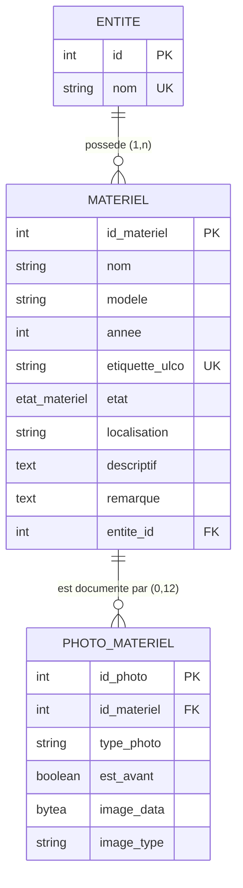
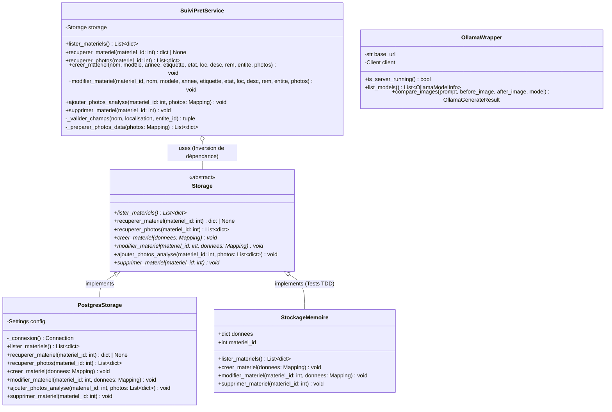
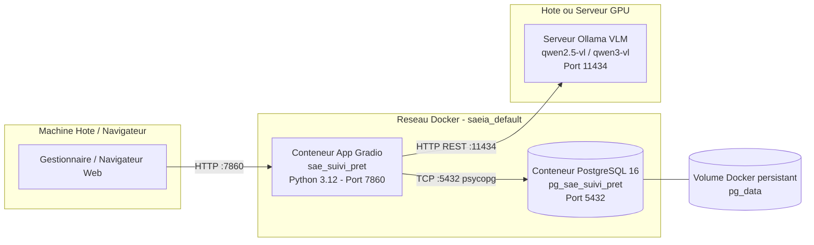

# Documentation Technique
## Projet SAE – Suivi de Prêt d'Ordinateurs avec IA Multimodale

---

## Table des matières

1. [Présentation et Objectifs Techniques](#1-prsentation-et-objectifs-techniques)
2. [Modélisation du Domaine](#2-modlisation-du-domaine)
   - 2.1 [Modèle Conceptuel de Données (Entité-Association)](#21-modle-conceptuel-de-donnes-entit-association)
   - 2.2 [Modèle Logique et Schéma Relationnel PostgreSQL](#22-modle-logique-et-schma-relationnel-postgresql)
   - 2.3 [Modélisation Orientée Objet (Diagramme de Classes UML)](#23-modlisation-oriente-objet-diagramme-de-classes-uml)
3. [Architecture Logicielle et Patrons de Conception](#3-architecture-logicielle-et-patrons-de-conception)
   - 3.1 [Découpage logique multicouche](#31-dcoupage-logique-multicouche)
   - 3.2 [Patrons de conception (Design Patterns) mis en œuvre](#32-patrons-de-conception-design-patterns-mis-en-uvre)
   - 3.3 [Architecture physique multi-tiers et conteneurisation](#33-architecture-physique-multi-tiers-et-conteneurisation)
4. [Production du Code Source et Standards](#4-production-du-code-source-et-standards)
   - 4.1 [Normes et conventions de nommage](#41-normes-et-conventions-de-nommage)
   - 4.2 [Typage statique et programmation défensive](#42-typage-statique-et-programmation-dfensive)
   - 4.3 [Gestion hiérarchique des exceptions](#43-gestion-hirarchique-des-exceptions)
5. [Processus de Génération (« Build »)](#5-processus-de-gnration--build-)
   - 5.1 [Construction de l'image Docker](#51-construction-de-limage-docker)
   - 5.2 [Pipeline d'intégration continue (CI/CD GitHub Actions)](#52-pipeline-dintgration-continue-cicd-github-actions)
6. [Processus de Déploiement et d'Exploitation](#6-processus-de-dploiement-et-dexploitation)
   - 6.1 [Configuration par variables d'environnement](#61-configuration-par-variables-denvironnement)
   - 6.2 [Orchestration Docker Compose](#62-orchestration-docker-compose)
   - 6.3 [Commandes d'administration et procédures de maintenance](#63-commandes-dadministration-et-procdures-de-maintenance)
7. [Documentation Interne du Code Source (API)](#7-documentation-interne-du-code-source-api)

---

## 1. Présentation et Objectifs Techniques

Le système assure la traçabilité physique intégrale des ordinateurs portables prêtés aux étudiants par une institution universitaire (IUT / ULCO).
Il permet :
- L'administration complète du parc de machines (inventaire, fiche technique, affectation administrative, état physique).
- L'enregistrement des photographies haute définition d'état initial lors de la remise (état « avant »).
- La collecte des photographies d'état lors de la restitution (état « après »).
- L'évaluation différentielle automatisée via un modèle de vision par ordinateur (VLM - *Vision Language Model*) servi localement via Ollama, produisant un rapport JSON d'anomalies (rayures, fissures, déformations, touches manquantes) localisées par boîtes englobantes (`bounding boxes`).

Le système est conçu selon les principes d'architecture découplée, de testabilité unitaire et de robustesse en production.

---

## 2. Modélisation du Domaine

### 2.1 Modèle Conceptuel de Données (Entité-Association)

Le domaine métier s'articule autour de trois entités fondamentales :
- **Entité (Organisation)** : Organisme ou département propriétaire du matériel (ex. `ULCO`).
- **Matériel (Ordinateur)** : Machine physique soumise au prêt, caractérisée par ses attributs d'identification et son état courant.
- **Photo_Matériel** : Cliché photographique associé à un angle de vue spécifique de la machine, qualifié par un discriminant temporel (`est_avant = TRUE` pour l'état initial, `FALSE` pour la restitution).



---

### 2.2 Modèle Logique et Schéma Relationnel PostgreSQL

Le schéma physique est matérialisé par le script [`database/01-tables.sql`](file:///c:/cours/BUT3/saeia/database/01-tables.sql) :

```sql
-- 1. Énumération des états physiques d'un matériel
CREATE TYPE etat_materiel AS ENUM (
    'OK',
    'Réservé',
    'En réparation',
    'Endommagé',
    'Disparu'
);

-- 2. Entités de rattachement
CREATE TABLE IF NOT EXISTS entites (
    id SERIAL PRIMARY KEY,
    nom VARCHAR(255) NOT NULL UNIQUE
);

-- 3. Matériels informatiques
CREATE TABLE IF NOT EXISTS materiels (
    id_materiel SERIAL PRIMARY KEY,
    nom VARCHAR(255) NOT NULL,
    modele VARCHAR(255),
    annee INT,
    etiquette_ulco VARCHAR(255) UNIQUE,
    etat etat_materiel NOT NULL DEFAULT 'OK',
    localisation VARCHAR(255) NOT NULL,
    descriptif TEXT,
    remarque TEXT,
    entite_id INT NOT NULL REFERENCES entites(id) ON DELETE CASCADE,
    image_data BYTEA,
    image_type VARCHAR(50)
);

-- 4. Photographies avant / après associées
CREATE TABLE IF NOT EXISTS photos_materiels (
    id_photo SERIAL PRIMARY KEY,
    id_materiel INT NOT NULL REFERENCES materiels(id_materiel) ON DELETE CASCADE,
    type_photo VARCHAR(50) NOT NULL,
    est_avant BOOLEAN NOT NULL DEFAULT TRUE,
    image_data BYTEA NOT NULL,
    image_type VARCHAR(50) NOT NULL,
    UNIQUE (id_materiel, type_photo, est_avant)
);
```

#### Points remarquables de conception BDD :
1. **Intégrité référentielle en cascade** : `ON DELETE CASCADE` garantit qu'en cas de suppression d'un matériel, l'ensemble de ses photographies haute résolution est automatiquement purgé sans laisser d'enregistrements orphelins.
2. **Contrainte composite d'unicité** : `UNIQUE (id_materiel, type_photo, est_avant)` permet de stocker exactement **une** photo de référence (état avant) et **une** photo de restitution (état après) pour chacun des 6 angles de vue (`dessus`, `dessous`, `ecran`, `clavier`, `connectique_gauche`, `connectique_droite`).
3. **Typage énuméré strict** : Le type PostgreSQL `etat_materiel` interdit en base toute valeur d'état non reconnue par le domaine métier.

---

### 2.3 Modélisation Orientée Objet (Diagramme de Classes UML)

Le diagramme ci-dessous représente la hiérarchie des classes métier, des abstractions de persistance et du client IA :



---

## 3. Architecture Logicielle et Patrons de Conception

### 3.1 Découpage logique multicouche

Le projet suit une **architecture en couches** étanche et modulaire :

```
┌─────────────────────────────────────────────────────────────┐
│               Couche Présentation (IHM)                     │
│                   src/suivi_pret/ui_gradio.py               │
│  - Formulaires d'ajout & modification                       │
│  - Liste interactive & double confirmation de suppression   │
│  - Zone d'analyse comparative & rendu des photos            │
└──────────────────────────────┬──────────────────────────────┘
                               │ appelle
┌──────────────────────────────▼──────────────────────────────┐
│                  Couche Service Métier                      │
│                src/suivi_pret/service/core.py               │
│  - Validation défensive des champs requis                   │
│  - Normalisation des chaînes de caractères (strip)          │
│  - Redimensionnement et compression d'images (Pillow)       │
└──────────────┬──────────────────────────────┬───────────────┘
               │ orchestre                    │ sollicite
┌──────────────▼─────────────┐ ┌──────────────▼───────────────┐
│     Couche Persistance     │ │     Couche Intégration IA   │
│  src/suivi_pret/storage/   │ │  src/.../ollama_client/     │
│  - Contrat abstrait Storage│ │  - OllamaWrapper            │
│  - Driver PostgresStorage  │ │  - ia_comparaison.py        │
│    (requêtes SQL / psycopg)│ │  - Validation stricte JSON   │
└──────────────┬─────────────┘ └──────────────┬───────────────┘
               │ SQL                          │ HTTP REST
┌──────────────▼─────────────┐ ┌──────────────▼───────────────┐
│     Base PostgreSQL 16     │ │    Serveur Local Ollama      │
│         (Port 5432)        │ │  (Modèle VLM - Port 11434)   │
└────────────────────────────┘ └──────────────────────────────┘
```

---

### 3.2 Patrons de conception (Design Patterns) mis en œuvre

1. **Repository / Data Access Object (DAO)** :
   - Encapsulation des accès à la base de données dans [`PostgresStorage`](file:///c:/cours/BUT3/saeia/src/suivi_pret/storage/postgres.py) via l'interface abstraite [`Storage`](file:///c:/cours/BUT3/saeia/src/suivi_pret/storage/base.py).
   - *Bénéfice :* Le service métier ignore la nature du stockage sous-jacent (PostgreSQL, SQLite, mémoire).
2. **Inversion de dépendance (Dependency Injection)** :
   - Le constructeur de `SuiviPretService` reçoit une instance concrète de `Storage` : `service = SuiviPretService(PostgresStorage())`.
   - *Bénéfice :* Permet d'injecter `StockageMemoire` lors de l'exécution des tests unitaires sans nécessiter de serveur PostgreSQL actif.
3. **Adapter / Wrapper Pattern** :
   - [`OllamaWrapper`](file:///c:/cours/BUT3/saeia/src/suivi_pret/ollama_client/vlm.py) adapte les endpoints HTTP bruts de l'API Ollama (`/api/generate`, `/api/tags`) en une interface Python fortement typée renvoyant des dataclasses (`OllamaGenerateResult`, `OllamaModelInfo`).
4. **Data Normalization & DTO** :
   - Normalisation systématique des données avant persistance (suppression des espaces superflus, conversion des entiers, typage MIME déduit par `mimetypes`).

---

### 3.3 Architecture physique multi-tiers et conteneurisation

L'application est conteneurisée selon une architecture **3-Tiers** orchestrée par Docker Compose :



- **Tiers Présentation / Applicatif** : Conteneur `sae_suivi_pret` exécutant l'interface Gradio et le service Python.
- **Tiers Données** : Conteneur `pg_sae_suivi_pret` avec volume monté `pg_data` pour la pérennité des données et montage en lecture seule du dossier `./database` pour l'initialisation automatique.
- **Tiers Vision IA** : Serveur Ollama hébergeant le modèle de vision multimodal.

---

## 4. Production du Code Source et Standards

### 4.1 Normes et conventions de nommage

Le code source respecte scrupuleusement la **PEP 8** et les conventions de l'écosystème Python :
- **Modules et packages** : Noms en minuscules avec tirets bas (`suivi_pret`, `ia_comparaison.py`, `ui_gradio.py`).
- **Classes** : Notation PascalCase (`SuiviPretService`, `PostgresStorage`, `OllamaWrapper`).
- **Méthodes et variables** : Notation snake_case explicite (`lister_materiels`, `ajouter_photos_analyse`, `etiquette_ulco`).
- **Constantes** : Majuscules (`TAILLE_MAX_PHOTO`, `TYPES_PHOTOS`, `GRAVITES_AUTORISEES`).

### 4.2 Typage statique et programmation défensive

- Utilisation de `from __future__ import annotations` et de la bibliothèque standard `typing` (`Mapping`, `Any`, `tuple`, `dict`, `list`).
- Vérification des paramètres obligatoires dans `_valider_champs()` :
  ```python
  nom = (nom or "").strip()
  localisation = (localisation or "").strip()
  if not nom:
      raise ValueError("Le nom de l'ordinateur est obligatoire.")
  ```
- Redimensionnement systématique des photographies (`TAILLE_MAX_PHOTO = (1024, 1024)`) avec conversion de l'espace colorimétrique en RGB pour éviter toute incompatibilité de format avec le décodeur d'Ollama.

### 4.3 Gestion hiérarchique des exceptions

Les erreurs techniques sont isolées et hiérarchisées pour ne jamais faire crasher l'application :

```
StorageError (Exception générique de stockage)
├── DuplicateMaterielError (Violation de contrainte UNIQUE sur etiquette_ulco)
├── EntityNotFoundError (Entité de rattachement inexistante en base)
└── MaterielNotFoundError (Matériel introuvable lors d'une mise à jour)

OllamaError (Exception générique IA)
├── OllamaConnectionError (Serveur Ollama injoignable)
├── OllamaResponseError (Réponse HTTP ou JSON invalide)
└── OllamaServerStartError (Échec du démarrage de l'instance locale)
```

Dans l'interface utilisateur Gradio :
- Les erreurs de validation utilisateur provoquent l'affichage d'un message d'avertissement jaune (`gr.Warning`), tout en conservant l'état des composants sans blocage.
- Les erreurs système critiques sont tracées par le module de log Python (`logger.exception`) et remontées sous forme d'alerte (`gr.Error`).

---

## 5. Processus de Génération (« Build »)

### 5.1 Construction de l'image Docker

Le fichier [`docker/Dockerfile`](file:///c:/cours/BUT3/saeia/docker/Dockerfile) implémente la construction de l'image applicative :

```dockerfile
FROM python:3.12-slim
WORKDIR /app
COPY requirements.txt ./
RUN pip install --no-cache-dir -r requirements.txt
COPY . /app
ENV PYTHONUNBUFFERED=1
EXPOSE 7860
CMD ["python", "-m", "src.suivi_pret.ui_gradio"]
```

#### Optimisations appliquées :
1. Image de base légère `python:3.12-slim` pour réduire l'empreinte disque et les failles de sécurité.
2. Mise en cache des couches Docker : `requirements.txt` est copié et installé **avant** le code source, évitant de retélécharger les bibliothèques lourdes (Pillow, Gradio, Psycopg) à chaque modification de code.
3. `PYTHONUNBUFFERED=1` pour forcer l'écriture immédiate des logs dans la console Docker.

---

### 5.2 Pipeline d'intégration continue (CI/CD GitHub Actions)

Le fichier [`.github/workflows/ci.yml`](file:///c:/cours/BUT3/saeia/.github/workflows/ci.yml) automatise les vérifications qualité à chaque `push` et `pull_request` :

```yaml
name: CI

on:
  push:
  pull_request:

jobs:
  checks:
    runs-on: ubuntu-latest
    steps:
      - name: Récupérer le dépôt
        uses: actions/checkout@v4

      - name: Installer Python
        uses: actions/setup-python@v5
        with:
          python-version: "3.12"
          cache: pip

      - name: Installer les dépendances
        run: python -m pip install -r requirements.txt

      - name: Vérifier la syntaxe Python
        run: python -m compileall -q src

      - name: Vérifier l'import du client Ollama
        run: python -c "from src.suivi_pret.ollama_client.vlm import OllamaWrapper; print(OllamaWrapper.__name__)"

      - name: Exécuter les tests unitaires
        run: python -m unittest discover -s tests -v
```

Ce pipeline garantit qu'aucune régression syntaxique, aucun import défaillant ni aucun test unitaire en échec ne peut être fusionné dans la branche principale.

---

## 6. Processus de Déploiement et d'Exploitation

### 6.1 Configuration par variables d'environnement

La configuration est centralisée dans le fichier `.env` (dérivé de `.env.example`) :

| Variable | Valeur par défaut | Description |
| :--- | :--- | :--- |
| `POSTGRES_USER` | `sae_user` | Utilisateur de la base PostgreSQL |
| `POSTGRES_PASSWORD` | `sae_password` | Mot de passe de la base |
| `POSTGRES_DB` | `sae_db` | Nom de la base de données |
| `POSTGRES_HOST` | `pg` (Docker) / `localhost` | Hôte du serveur de base de données |
| `POSTGRES_PORT` | `5432` | Port de connexion PostgreSQL |
| `OLLAMA_HOST` | `http://host.docker.internal:11434` | URL d'accès à l'API Ollama |
| `OLLAMA_VLM_MODEL` | `qwen2.5-vl:7b` ou `qwen3-vl:8b` | Identifiant du modèle multimodal |

---

### 6.2 Orchestration Docker Compose

Le fichier [`docker-compose.yml`](file:///c:/cours/BUT3/saeia/docker-compose.yml) définit l'infrastructure :

```yaml
services:
  app:
    build:
      context: .
      dockerfile: docker/Dockerfile
    container_name: sae_suivi_pret
    restart: unless-stopped
    ports:
      - "7860:7860"
    env_file:
      - .env
    environment:
      PYTHONUNBUFFERED: "1"
    volumes:
      - ./src/suivi_pret:/app/src/suivi_pret

  pg:
    image: postgres:16-alpine
    container_name: pg_sae_suivi_pret
    restart: unless-stopped
    environment:
      POSTGRES_USER: ${POSTGRES_USER}
      POSTGRES_PASSWORD: ${POSTGRES_PASSWORD}
      POSTGRES_DB: ${POSTGRES_DB}
    volumes:
      - pg_data:/var/lib/postgresql/data
      - ./database:/docker-entrypoint-initdb.d:ro
    ports:
      - "5432:5432"
    healthcheck:
      test: ["CMD-SHELL", "pg_isready -U ${POSTGRES_USER} -d ${POSTGRES_DB}"]
      interval: 10s
      timeout: 5s
      retries: 5

volumes:
  pg_data:
```

> [!NOTE]
> Le volume monté `./src/suivi_pret:/app/src/suivi_pret` permet le rechargement à chaud du code de l'interface et du service sans devoir reconstruire l'image Docker à chaque modification.

---

### 6.3 Commandes d'administration et procédures de maintenance

#### Démarrage complet du système
```bash
docker compose up -d --build
```

#### Consultation de l'état des conteneurs
```bash
docker compose ps
```

#### Suivi des logs en temps réel
```bash
docker compose logs -f app
```

#### Redémarrage de l'application seule
```bash
docker compose restart app
```

#### Réinitialisation complète de la base de données (avec purge des volumes)
```bash
docker compose down -v
docker compose up -d --build
```

---

## 7. Documentation Interne du Code Source (API)

Les principaux composants comportent une documentation in-code (docstrings) normalisée :

- `SuiviPretService.creer_materiel(nom, modele, annee, etiquette_ulco, etat, localisation, descriptif, remarque, entite_id, photos)` :
  Valide et normalise les entrées, redimensionne les 6 photos fournies et persiste le matériel avec `est_avant = TRUE`.
- `SuiviPretService.modifier_materiel(materiel_id, ...)` :
  Met à jour les métadonnées d'un ordinateur et met à jour uniquement les photographies fournies (en conservant les anciennes si aucune nouvelle image n'est transmise).
- `SuiviPretService.ajouter_photos_analyse(materiel_id, photos)` :
  Insère ou remplace les clichés de restitution associés au matériel avec le discriminateur `est_avant = FALSE`.
- `valider_reponse_json(reponse: str) -> dict` :
  Valide rigoureusement le JSON émis par Ollama (présence de `zones`, conformité des `bbox` positives et ordonnées, contrôle des libellés de gravité).
- `OllamaWrapper.compare_images(prompt, before_image, after_image, model) -> OllamaGenerateResult` :
  Encode les clichés en base64, assemble la requête multipart/JSON vers l'API Ollama et retourne le résultat textuel de comparaison.

