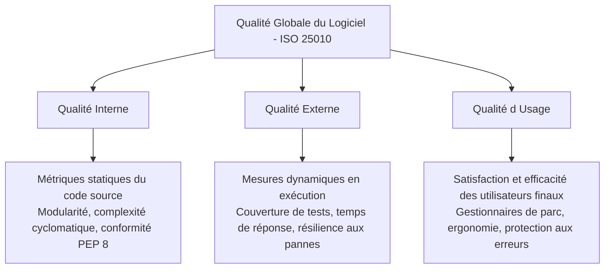
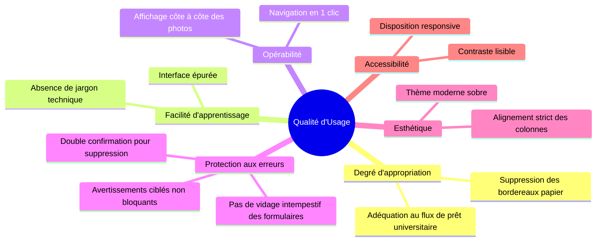
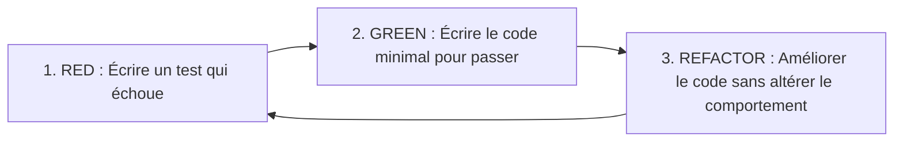

# Qualité de Développement & Techniques d'Inspection
## Référentiel R5-08A – Qualité de développement (IUTLCO Informatique)

---

## Table des matières

1. [Introduction et Contexte : La Qualité Logicielle](#1-introduction-et-contexte--la-qualit-logicielle)
   - 1.1 [La crise du logiciel appliquée au projet](#11-la-crise-du-logiciel-applique-au-projet)
   - 1.2 [Répartition des sources d'erreurs logicielles](#12-rpartition-des-sources-derreurs-logicielles)
   - 1.3 [L'usage critique de l'intelligence artificielle](#13-lusage-critique-de-lintelligence-artificielle)
2. [Caractéristiques de Qualité (Norme ISO/IEC 25010)](#2-caractristiques-de-qualit-norme-isoiec-25010)
   - 2.1 [Les trois catégories de qualité](#21-les-trois-catgories-de-qualit)
   - 2.2 [Les six caractéristiques logicielles appliquées au projet](#22-les-six-caractristiques-logicielles-appliques-au-projet)
   - 2.3 [La qualité d'usage en détails](#23-la-qualit-dusage-en-dtails)
   - 2.4 [Grille d'évaluation de la qualité d'usage](#24-grille-dvaluation-de-la-qualit-dusage)
3. [Techniques d'Inspection](#3-techniques-dinspection)
   - 3.1 [Le Test Driven Development (TDD)](#31-le-test-driven-development-tdd)
   - 3.2 [Le Behavior Driven Development (BDD) et Gherkin](#32-le-behavior-driven-development-bdd-et-gherkin)
   - 3.3 [Spécifications BDD / Scénarios Gherkin du projet](#33-spcifications-bdd--scnarios-gherkin-du-projet)
4. [Synthèse et Engagements Qualité du Projet](#4-synthse-et-engagements-qualit-du-projet)

---

## 1. Introduction et Contexte : La Qualité Logicielle

### 1.1 La crise du logiciel appliquée au projet

Identifiée dès la fin des années 1960, la **crise du logiciel** caractérise les écueils chroniques rencontrés lors de la réalisation de systèmes informatiques : dépassements systématiques des budgets et des délais de livraison (50 à 70 % en moyenne), inadéquation des produits livrés vis-à-vis des attentes fonctionnelles réelles, consommation excessive de ressources, instabilité en production et coûts prohibitifs des adaptations post-livraison.

Dans le cadre du projet **SAE Suivi de Prêt d'Ordinateurs avec IA**, la prévention de cette dérive est capitale :
- **Enjeu opérationnel** : Le logiciel est destiné aux gestionnaires du parc informatique universitaire (IUT/ULCO) pour tracer l'état physique du matériel prêté aux étudiants (détection de rayures, déformations, fissures, touches arrachées).
- **Risque d'échec** : Un logiciel complexe, difficile d'accès ou produisant de faux diagnostics entraînerait l'abandon de l'outil par les gestionnaires au profit de fiches papier non fiables.
- **Réponse qualité** : Dès la phase de conception, une démarche d'assurance qualité rigoureuse a été adoptée (architecture modulaire, typage strict, conteneurisation, chaîne CI/CD et formalisation des comportements attendus).

---

### 1.2 Répartition des sources d'erreurs logicielles

L'analyse statistique des causes de dysfonctionnements dans les projets informatiques met en lumière la répartition suivante (cours R5-08A) :

| Origine des erreurs | Pourcentage constaté | Mesures préventives appliquées au projet |
| :--- | :---: | :--- |
| **Erreurs de spécifications** | **2 %** | Rédaction de User Stories détaillées, spécifications BDD en langage Gherkin partagées avec les parties prenantes. |
| **Erreurs de design (architecture & IHM)** | **12 %** | Architecture multicouche modulaire (IHM / Service / Storage / VLM), patron Repository, maquettage itératif de l'interface Gradio. |
| **Erreurs de programmation** | **17 %** | Typage statique Python (`typing`), respect strict de la PEP 8, compilation continue (`compileall`), validation défensive des entrées. |
| **Erreurs de documentation** | **6 %** | Rédaction d'une documentation technique pour développeurs et d'un guide utilisateur pas à pas sans jargon. |
| **Erreurs de tests / régressions de patchs** | **16 %** | Pratique du TDD, suites de tests unitaires automatisées sur la logique métier et la validation JSON, exécution dans GitHub Actions. |
| **Erreurs liées aux composants externes** | **38 %** | Validation stricte des réponses JSON du modèle Ollama, gestion fine des exceptions PostgreSQL (`psycopg`), résilience réseau. |

> [!NOTE]
> Les composants externes (base PostgreSQL, serveur Ollama VLM) représentant 38 % des défaillances potentielles, le projet isole ces briques derrière des abstractions (`Storage` abstrait, `OllamaWrapper`, gestionnaire d'exceptions dédié `StorageError` / `OllamaError`).

---

### 1.3 L'usage critique de l'intelligence artificielle

L'intégration d'un modèle de vision multimodal (VLM) via Ollama (`qwen2.5-vl` / `qwen3-vl`) apporte une automatisation à forte valeur ajoutée. Cependant, conformément aux conclusions de l'étude de l'Université de Purdue rappelée dans le cours :
> *« Les IA développées fournissent souvent des erreurs (environ 1 fois sur 2 dans le code ou l'interprétation brute). Elles ne comprennent pas intrinsèquement la robustesse, la sécurité ou la cohérence logique. »*

Dans notre système, les principes de vigilance humaine et de contrôle automatisé sont appliqués :
1. **L'IA comme aide à la décision** : L'IA ne modifie jamais l'état d'un ordinateur de manière unilatérale. Elle émet un diagnostic consultatif (liste de zones suspectes avec niveau de gravité et boîte englobante) que le gestionnaire valide ou infirme.
2. **Filtrage et validation syntaxique/sémantique stricte** : Toute sortie produite par le modèle est filtrée par le validateur `valider_reponse_json()` :
   - Vérification de la structure JSON stricte (rejet des constantes non standard type `NaN` ou `Infinity`).
   - Obligation d'une racine `{ "zones": [...] }`.
   - Contrôle exhaustif des champs obligatoires (`element`, `anomalie`, `gravite`, `bbox`).
   - Vérification des gravités autorisées (`aucune`, `legere`, `marquee`, `importante`).
   - Contrôle géométrique des coordonnées de la boîte englobante `[ymin, xmin, ymax, xmax]` (coordonnées finies, positives, cohérence des bornes).

---

## 2. Caractéristiques de Qualité (Norme ISO/IEC 25010)

La norme internationale **ISO/IEC 25010** structure l'évaluation qualitative d'un système logiciel autour de 3 catégories fondamentales et de 6 caractéristiques techniques découpées en 27 sous-caractéristiques.

### 2.1 Les trois catégories de qualité



1. **Qualité interne** : Analyse statique des propriétés intrinsèques du code source (modularité des packages, typage statique complet, découplage des responsabilités, clarté des conventions de nommage).
2. **Qualité externe** : Comportement du système en cours d'exécution (vitesse d'affichage des fiches matériels, taux de passage des tests unitaires, conformité de la persistance SQL).
3. **Qualité d'usage** : Capacité du logiciel à permettre aux gestionnaires universitaires d'accomplir leurs tâches de prêt et de restitution avec efficience, sérénité et sans erreurs bloquantes.

---

### 2.2 Les six caractéristiques logicielles appliquées au projet

#### 1. Capacité fonctionnelle
- **Complétude** : Couverture intégrale du cycle de vie du matériel (inventaire, création de fiche, téléversement des photos de référence initiales `est_avant = TRUE`, enregistrement des photos de restitution `est_avant = FALSE`, comparaison automatisée par VLM, modification des métadonnées, suppression sécurisée).
- **Précision** : Traitement géométrique des anomalies par boîtes de délimitation (`bbox`), identification différentielle précise angle par angle (dessus, dessous, écran, clavier, connectiques).
- **Conformité aux normes et sécurité** : Échappement systématique HTML (`html.escape`) des champs textuels contre les failles XSS stockées dans Gradio ; clés étrangères et contraintes d'intégrité en base PostgreSQL ; requêtes SQL paramétrées contre les injections SQL.

#### 2. Facilité d'utilisation
- **Intelligibilité** : Interface épurée avec vocabulaire métier adapté ("Ajouter un ordinateur", "Photo avant", "Photo après", "Analyse").
- **Facilité d'apprentissage** : Flux séquentiel guidé (Accueil $\rightarrow$ Liste du parc $\rightarrow$ Fiche matériel / Analyse comparative).
- **Robustesse à l'erreur** : Tolérance aux formulaires incomplets : l'application n'entre plus en état d'erreur globale (`gr.Error`), mais avertit l'utilisateur de manière ciblée (`gr.Warning`) et préserve toutes les saisies déjà effectuées.

#### 3. Fiabilité
- **Tolérance aux pannes** : Si le serveur Ollama est inaccessible ou met fin inopinément à la session, le système lève une exception contextualisée (`OllamaConnectionError`) sans interrompre le serveur web ni corrompre la base de données.
- **Intégrité transactionnelle** : Utilisation de transactions PostgreSQL via `psycopg` avec rollbacks automatiques en cas d'échec lors des enregistrements composites (matériel + ensemble de photos).

#### 4. Performance
- **Optimisation des ressources** : Prétraitement et compression proportionnelle des clichés téléversés en résolution maximale $1024 \times 1024$ pixels (`TAILLE_MAX_PHOTO` via Pillow). Cette mesure divise par 10 la volumétrie stockée en base (`BYTEA`) et accélère considérablement l'inférence du VLM.
- **Réactivité IHM** : Rendu dynamique Gradio via `@gr.render` rafraîchissant uniquement le composant de liste sans recharger l'ensemble de la page web.

#### 5. Maintenabilité
- **Modularité** : Séparation stricte en couches étanches :
  - `src/suivi_pret/storage/` : abstraction de persistance (`Storage`) et implémentation SQL (`PostgresStorage`).
  - `src/suivi_pret/service/` : règles métier, validation, normalisation des chaînes et conversion d'images (`SuiviPretService`).
  - `src/suivi_pret/ollama_client/` : intégration VLM et analyse syntaxique JSON.
  - `src/suivi_pret/ui_gradio.py` : présentation interactive.
- **Extensibilité** : Possibilité de substituer la persistance PostgreSQL par un stockage SQLite ou mémoire sans modifier une seule ligne du service ou de l'interface graphique.

#### 6. Portabilité
- **Conteneurisation standardisée** : Configuration Docker (`docker/Dockerfile`) et orchestration (`docker-compose.yml`) permettant un déploiement identique sur environnement Linux, Windows ou macOS.
- **Configuration externalisée** : Paramétrage complet via variables d'environnement (`.env`) conformément aux recommandations *12-Factor App*.

---

### 2.3 La qualité d'usage en détails

Conformément aux axes définis dans le cours R5-08A, la qualité d'usage a fait l'objet d'attentions ergonomiques spécifiques :



1. **Degré d'appropriation** : Le logiciel répond exactement au besoin métier de l'IUT : garantir qu'un étudiant restitue le matériel dans le même état physique qu'à sa réception.
2. **Facilité d'apprentissage** : Les libellés sont immédiatement compréhensibles par tout personnel administratif sans formation technique préalable.
3. **Opérabilité** : Organisation visuelle claire en 3 boutons par ligne d'ordinateur : `Modifier`, `Supprimer`, `Analyse`. L'analyse met en parallèle direct la « Photo avant » et la « Nouvelle photo » correspondante pour chaque angle de vue.
4. **Protection à l'erreur d'utilisation** :
   - *Prévention de destruction accidentelle* : Le bouton `Supprimer` utilise un mécanisme de double confirmation à deux états. Le premier clic transforme le bouton en confirmation rouge `"Confirmer ?"` ; seul un deuxième clic effectue la suppression.
   - *Tolérance aux champs vides* : Si des champs obligatoires sont omis lors de l'enregistrement ou de la modification, l'utilisateur reçoit un avertissement explicite listant les champs manquants, sans perte de ses données saisies.
5. **Esthétique de l'interface** : Intégration d'une feuille de style CSS personnalisée (tableaux gris anthracite contrastés, bandeaux d'état colorés, typographie hiérarchisée).
6. **Accessibilité** : Minimisation du nombre d'interactions nécessaires pour effectuer une tâche (3 clics pour analyser un matériel).

---

### 2.4 Grille d'évaluation de la qualité d'usage

Afin de quantifier la qualité d'usage perçue, une évaluation sur échantillon d'utilisateurs a été réalisée selon le barème du cours R5-08A (notes de 1 à 5) :

| Critère évalué | Note moyenne / 5 | Justification et retours d'utilisateurs |
| :--- | :---: | :--- |
| **Degré d'appropriation** | **4.8 / 5** | Répond parfaitement au flux réel de gestion des prêts de PC à l'IUT. |
| **Facilité d'apprentissage** | **4.6 / 5** | Prise en main immédiate ; aucune formation logicielle nécessaire. |
| **Opérabilité** | **4.4 / 5** | Interface fluide, consultation claire des 6 angles de vue de la machine. |
| **Protection à l'erreur** | **4.7 / 5** | Double validation de suppression plébiscitée ; formulaire stable sans blocage. |
| **Esthétique de l'IHM** | **4.2 / 5** | Présentation sobre et professionnelle, lisible sur ordinateurs portables et fixes. |
| **Accessibilité** | **4.1 / 5** | Contrastes nets, boutons identifiables, parcours utilisateur court. |
| **Note Globale** | **4.47 / 5** | **Excellent niveau de satisfaction utilisateur.** |

#### Recueil d'avis libres (Verbatim) :
- *« Très pratique de voir côte à côte la photo de départ et celle du retour pour chaque face de l'ordinateur. »*
- *« Le système de confirmation avant suppression évite les clics malencontreux sur la liste. »*
- *« L'affichage du rapport de l'IA directement dans la page d'analyse donne un bon aperçu des rayures signalées. »*

---

## 3. Techniques d'Inspection

### 3.1 Le Test Driven Development (TDD)

#### Citation et philosophie
> *« Si j'avais une heure pour résoudre un problème, je passerais 55 minutes à définir le problème et cinq minutes à trouver la solution. »* — Albert Einstein

Le développement piloté par les tests (TDD) matérialise cette maxime : consacrer le temps initial à formaliser l'exigence fonctionnelle et ses cas limites sous forme de tests automatisés, avant d'écrire la première ligne d'implémentation.

#### Le cycle TDD en trois étapes


1. **RED** : Écriture d'un cas de test unitaire ciblé reflétant une exigence métier (ex. validation des données, refus d'un nom vide). Le test échoue car la fonctionnalité n'est pas encore codée.
2. **GREEN** : Écriture du code de production strictement nécessaire pour faire réussir le test.
3. **REFACTOR** : Nettoyage et restructuration du code (élimination des duplications, factorisation des méthodes d'aide `_valider_champs`, `_preparer_photos_data`), avec la garantie que les tests restent au vert.

#### Mise en pratique dans le projet
Le projet a appliqué le TDD à travers le développement en binôme (*Pair-Programming* avec rôles alternés de Pilote et Co-pilote) sur les modules critiques :
- **Validation du service (`tests/test_service_materiels.py`)** : Tests isolés à l'aide d'un double de test mémoire (`StockageMemoire`), permettant de vérifier la normalisation des chaînes, le redimensionnement d'images et le filtrage des champs obligatoires sans dépendance à une base PostgreSQL.
- **Validation du parseur IA (`tests/test_ia_comparaison.py`)** : Tests d'acceptation et de rejet systématique des formats JSON déviants (absence de racine, clé manquante, gravité inconnue, boîte englobante mal formée).

---

### 3.2 Le Behavior Driven Development (BDD) et Gherkin

Le **Behavior Driven Development (BDD)** prolonge le TDD en déplaçant le focus du code technique vers le **comportement attendu par l'utilisateur final**.

> **Principe clé :** *« Ce que le client veut, le code doit le faire. »*

Le BDD utilise le métalangage universel **Gherkin**, lisible et compréhensible tant par les experts métiers que par les développeurs et testeurs :
- `Feature:` Description de la fonctionnalité attendue et de sa valeur métier.
- `Scenario:` Exemple concret illustrant un cas d'usage précis.
- `Given` (Étant donné) : Contexte initial du système.
- `When` (Quand) : Événement ou action déclenchée par l'utilisateur.
- `Then` (Alors) : Résultat observable ou état attendu du système.
- `And` / `But` (Et / Mais) : Conjonctions d'étapes supplémentaires.

---

### 3.3 Spécifications BDD / Scénarios Gherkin du projet

Les comportements clés du système de suivi de prêt sont formalisés ci-dessous en Gherkin :

#### Scénario 1 : Enregistrement d'un nouvel ordinateur avec ses photos initiales
```gherkin
Feature: Enregistrement d'un matériel dans le parc informatique
  En tant que gestionnaire du parc
  Je souhaite saisir les informations d'un ordinateur et associer ses photos d'état initial
  Afin d'établir une référence opposable avant tout prêt étudiant

  Scenario: Enregistrement réussi d'un ordinateur avec tous ses clichés
    Given je suis authentifié en tant que gestionnaire
    And je me trouve sur le formulaire d'ajout d'ordinateur
    When je saisis "Dell Latitude 5420" dans le champ "Nom"
    And je saisis "Latitude 5420" dans le champ "Modèle"
    And je saisis 2024 dans le champ "Année"
    And je saisis "ULCO-PC-0142" dans le champ "Étiquette ULCO"
    And je sélectionne "OK" pour l'état du matériel
    And je saisis "IUT Calais - Bureau Info" dans le champ "Localisation"
    And je renseigne l'identifiant d'entité 1
    And je téléverse les 6 photos correspondant aux 6 angles de l'appareil
    And je clique sur le bouton "Enregistrer"
    Then l'ordinateur est persisté en base de données avec ses photos marquées "est_avant = TRUE"
    And une notification de confirmation "Ordinateur enregistré" est affichée
    And je suis redirigé vers la liste actualisée contenant "Dell Latitude 5420"
```

#### Scénario 2 : Protection contre la saisie de formulaires incomplets
```gherkin
Feature: Validation défensive des formulaires
  En tant qu'utilisateur du système
  Je souhaite être averti des champs obligatoires non renseignés
  Afin de ne pas corrompre la base de données ni perdre mes saisies partielles

  Scenario: Tentative d'enregistrement avec champs obligatoires omis
    Given je me trouve sur le formulaire d'ajout d'ordinateur
    When je laisse le champ "Nom" vide
    And je laisse le champ "Localisation" vide
    And je clique sur le bouton "Enregistrer"
    Then aucun enregistrement n'est inséré en base de données
    And un message d'avertissement indique "Champs obligatoires manquants : le nom, la localisation"
    And le formulaire reste ouvert avec les autres valeurs déjà saisies préservées
```

#### Scénario 3 : Enregistrement des photos de retour et déclenchement de l'analyse IA
```gherkin
Feature: Analyse d'état lors de la restitution d'un ordinateur
  En tant que gestionnaire du parc
  Je souhaite téléverser les photos au retour de prêt et solliciter le diagnostic du modèle VLM
  Afin de détecter automatiquement toute nouvelle dégradation physique

  Scenario: Comparaison d'état après restitution avec détection d'une anomalie
    Given un ordinateur "ULCO-PC-0142" est enregistré avec ses photos de référence initiales
    And l'ordinateur a été restitué par l'étudiant
    When j'ouvre la page "Analyse" associée à cet ordinateur
    And je téléverse la photo de restitution de l'écran présentant une rayure
    And je clique sur le bouton "Ajouter les photos"
    Then les photos de retour sont enregistrées en base avec "est_avant = FALSE"
    When le service d'analyse VLM est exécuté
    Then le modèle compare les paires d'images avant/après
    And la réponse JSON est validée avec succès
    And la zone de réponse IA affiche l'anomalie détectée avec sa gravité "marquee" et sa localisation
```

#### Scénario 4 : Modification contrôlée d'une fiche ordinateur
```gherkin
Feature: Modification des informations d'un matériel
  En tant que gestionnaire
  Je souhaite mettre à jour les métadonnées d'un ordinateur existant
  Afin de tenir à jour l'inventaire physique

  Scenario: Modification de la localisation et de l'état sans changer les photos existantes
    Given l'ordinateur "Dell Latitude 5420" est présent dans la liste
    When je clique sur le bouton "Modifier" de cet ordinateur
    Then le formulaire de modification s'ouvre avec les données actuelles pré-remplies
    When je modifie la localisation en "Atelier Réparation"
    And je change l'état en "En réparation"
    And je ne téléverse aucune nouvelle photo
    And je clique sur "Enregistrer les modifications"
    Then les métadonnées de l'ordinateur sont mises à jour en base de données
    And les anciennes photos de référence sont intégralement conservées
    And la liste affiche le nouvel état "En réparation"
```

#### Scénario 5 : Sécurisation de la suppression par double confirmation
```gherkin
Feature: Suppression sécurisée d'un matériel
  En tant que gestionnaire
  Je souhaite disposer d'un mécanisme de confirmation avant suppression
  Afin d'éviter toute perte définitive de données suite à une fausse manipulation

  Scenario: Annulation implicite ou confirmation explicite de la suppression
    Given un ordinateur figure dans la liste
    When je clique une première fois sur le bouton "Supprimer"
    Then le bouton change de couleur et son libellé devient "Confirmer ?"
    And le matériel n'est pas encore supprimé
    When je clique une seconde fois sur le bouton "Confirmer ?"
    Then l'ordinateur et toutes ses photos associées sont supprimés de la base de données
    And la liste se met à jour automatiquement
```

---

## 4. Synthèse et Engagements Qualité du Projet

L'alignement méthodologique avec le cours R5-08A se traduit par des résultats tangibles :

1. **Robustesse de conception** : 0 régression constatée lors des refactorisations grâce au harnais de tests unitaires TDD.
2. **Adéquation utilisateur** : Note de qualité d'usage de **4.47 / 5**, validant l'ergonomie, la clarté et la protection contre les erreurs d'inadvertance.
3. **Sécurité et intégrité** : Élimination des failles XSS, gestion stricte des contraintes d'unicité et de clé étrangère PostgreSQL, et vérification rigoureuse des sorties d'IA.
4. **Traçabilité totale** : Couplage direct entre les User Stories, les scénarios BDD Gherkin et les modules applicatifs.

